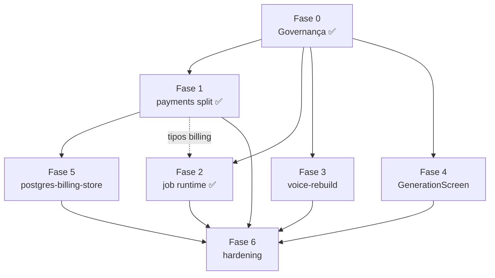

# Architecture Deepening — Plano de implementação

**Objetivo:** Reduzir god-modules, aplicar SRP/SOLID e melhorar testabilidade em backend, packages e web — sem alterar comportamento observável.

**Origem:** Sessão de arquitetura (2026-06-18), worktree `architecture-deepening`

**Governança de tamanho:** [`tests/governance/file-size-governance.test.ts`](../../../tests/governance/file-size-governance.test.ts)

**Disciplina de execução:** TDD obrigatório (Red → Green → Refactor) em todas as fases

---

## 1. Objetivo

O monorepo acumulou módulos monolíticos (god-modules) que concentram múltiplas responsabilidades — billing, runtime de jobs, voice rebuild, contratos, feature flags e telas web — dificultando testes unitários, revisão de PR e evolução segura.

Este programa trata a dívida estrutural em fases incrementais:

| Princípio | Aplicação |
|-----------|-----------|
| **SRP** | Cada arquivo exporta uma preocupação coesa (gateway ≠ ledger ≠ mapeamento de status) |
| **SOLID** | Dependências apontam para abstrações; barrels (`index.ts`) só reexportam |
| **Testabilidade** | Lógica extraída para funções/módulos puros, testáveis sem boot completo |
| **Governança** | Orçamento de **400 linhas** por arquivo TS de produção; allowlist temporária encolhe a cada fase |

**Fora do escopo:** mudanças de produto, novos endpoints, alteração de contratos públicos além de reorganização interna.

---

## 2. Fases (0–6)

### Fase 0 — Governança (file-size test) ✅ CONCLUÍDA

Estabelecer o guard-rail que impede novos god-modules e congela o tamanho dos existentes.

**Entregas:**

- Teste `file-size-governance.test.ts` com orçamento de 400 linhas
- Escopo: `apps/backend/src/**/*.ts` e `packages/*/src/**/*.ts` (exclui `*.d.ts`, `*.gen.ts`, paths `i18n/`)
- Allowlist temporária com 7 arquivos + baselines anti-regressão
- Helper `countLines()` em `tests/governance/shared.ts`

**Status:** done (2026-06-18)

---

### Fase 1 — Payments split ✅ CONCLUÍDA

Decompor `packages/payments/src/index.ts` (~1255 linhas) em módulos coesos.

**Alvo de módulos:**

| Módulo | Responsabilidade |
|--------|------------------|
| `gateway/` | Integração Stripe/Asaas, webhooks, idempotência de gateway |
| `service/` | Orquestração de billing (reservas, consumo, políticas) |
| `ledger/` | Entradas de ledger, saldo, histórico |
| `activation/` | `activateSubscription`, `ensureBillingCycleInitialized`, JIT |
| `types/` | Tipos e interfaces compartilhados do domínio billing |

**Barrel:** `packages/payments/src/index.ts` ≤ **80 linhas** (somente re-exports públicos).

**Status:** done (2026-06-18)

---

### Fase 2 — Job runtime ✅ CONCLUÍDA

Refatorar runtime durável e persistência de jobs.

**Entregas:**

- Extrair `job-status-mappers` (mapeamento PG ↔ domínio ↔ API)
- Testes de **paridade** entre store legado e adapter PG
- Isolar `execution-enqueue` (transação job + reserva + outbox)
- Refatorar `job-store.ts` e `durable-job-runtime.ts` em módulos ≤ 400 linhas
- Extrair `in-memory-job-repository.ts` (Map storage CRUD)

**Contexto:** ADR 0004 (runtime async durável); issues 48–57.

**Status:** done (2026-06-18)

### Fase 3 — Voice rebuild ✅ CONCLUÍDA

Decompor pipeline de rebuild de voz.

**Entregas:**

- Extrair fila (`voice-rebuild-queue.ts`) — schedule, drain, runner, waitForIdle
- Extrair pipeline (`voice-rebuild-pipeline.ts`) — extract → reconcile → derive → persist
- `voice-rebuild-service.ts` como factory fina (38 linhas)
- `apps/backend/tests/voice-rebuild-queue.test.ts`, `voice-rebuild-pipeline.test.ts`
- Manter contratos e testes de regressão de voz verdes

**Contexto:** ADRs 0006–0008 (reasoning, development, traits).

**Status:** done (2026-06-18)

---

### Fase 4 — GenerationScreen ✅ CONCLUÍDA

Refatorar a tela de geração web (~657 linhas).

**Entregas:**

- Extrair hooks (`useGenerationForm`, `useGenerationCommercialGate`)
- Componentes de apresentação menores (`GenerationPreviewSidebar`, `BriefingGuidancePanel`)
- `get-blocked-reason.ts` — função pura de mapeamento de bloqueio
- `GenerationScreen.tsx` como composição fina (349 linhas, ≤ 400)
- `tests/web/use-generation-commercial-gate.test.ts` — 8 testes para `getBlockedReason` e `isQualityModeAllowedForUser`

**Nota:** O teste de governança atual **não** cobre `apps/web/`; esta fase prepara o terreno para extensão futura do orçamento ao frontend.

**Status:** done (2026-06-18)

### Fase 5 — Postgres billing store split ✅ CONCLUÍDA

Decompor `apps/backend/src/infra/postgres-billing-store.ts`.

**Entregas:**

- Separar mappers, queries Kysely e adaptador de repositório
- Depende da estrutura de tipos/módulos da Fase 1 (`packages/payments`)
- Testes de persistência billing durável verdes

**Status:** done (2026-06-18)

---

### Fase 6 — Hardening

Fechar a allowlist restante e reforçar confiabilidade.

**Entregas:**

- Split `packages/feature-flags/src/index.ts` (registro, resolução, defaults)
- Split `packages/contracts/src/execution.ts` (tipos, estados, eventos)
- Split `apps/backend/src/config/config.ts` (env, validação, agrupamentos)
- Testes de **transport retry** para adapters AI/HTTP
- Allowlist de file-size **vazia** — nenhum arquivo acima de 400 linhas

---

## 3. Allowlist de governança

Fonte de verdade: [`tests/governance/file-size-governance.test.ts`](../../../tests/governance/file-size-governance.test.ts)

Cada entrada deve ser **removida da allowlist** (e do `FILE_SIZE_BASELINE`) quando a fase correspondente concluir, com todos os arquivos resultantes ≤ 400 linhas.

| Arquivo | Baseline (linhas) | Fase que remove |
|---------|-------------------|-----------------|
| ~~`packages/payments/src/index.ts`~~ | ~~1255~~ | **1** — removido (74 linhas) |
| ~~`apps/backend/src/jobs/job-store.ts`~~ | ~~437~~ | **2** — removido (255 linhas) |
| ~~`apps/backend/src/runtime/durable-job-runtime.ts`~~ | ~~466~~ | **2** — removido (324 linhas) |
| `apps/backend/src/product/voice/voice-rebuild-derivation.ts` | 447 | **3** — voice-rebuild |
| `apps/backend/src/product/voice/voice-rebuild-service.ts` | 547 | **3** — voice-rebuild |
| ~~`apps/backend/src/infra/postgres-billing-store.ts`~~ | ~~422~~ | **5** — removido (17 linhas facade) |
| `packages/feature-flags/src/index.ts` | 455 | **6** — hardening |
| `packages/contracts/src/execution.ts` | 476 | **6** — hardening |
| `apps/backend/src/config/config.ts` | 413 | **6** — hardening |

**Regra anti-regressão:** enquanto na allowlist, o arquivo **não pode crescer** além do baseline registrado.

---

## 4. Critérios de done por fase

### Fase 0 ✅

- [x] Teste de governança passa em CI
- [x] 7 arquivos na allowlist com baselines
- [x] Nenhum arquivo fora da allowlist excede 400 linhas

### Fase 1 — Payments split ✅

- [x] Módulos `gateway/`, `service/`, `ledger/`, `activation/`, `types/` existem e são coesos
- [x] `packages/payments/src/index.ts` ≤ 80 linhas
- [x] `packages/payments/src/index.ts` removido da allowlist
- [x] Módulos extraídos ≤ 400 linhas (`service.ts` permanece na allowlist até hardening)
- [x] `pnpm test:ci` verde; testes de billing/payments intactos

### Fase 2 — Job runtime ✅

- [x] `job-status-mappers` extraído e testado
- [x] Testes de paridade store/adapter passam
- [x] `execution-enqueue` isolado e testável
- [x] `job-store.ts` e `durable-job-runtime.ts` removidos da allowlist
- [x] `in-memory-job-repository.ts` extraído com testes dedicados
- [x] Todos os módulos resultantes ≤ 400 linhas
- [x] Suite durable (issues 48–57) verde

### Fase 3 — Voice rebuild

- [ ] Queue e pipeline extraídos
- [ ] `voice-rebuild-derivation.ts` e `voice-rebuild-service.ts` removidos da allowlist
- [ ] Todos os módulos resultantes ≤ 400 linhas
- [ ] Regressões de voz (`pnpm eval:reasoning`, `pnpm eval:development`) verdes

### Fase 4 — GenerationScreen ✅

- [x] Hooks dedicados extraídos de `GenerationScreen.tsx`
- [x] Componentes de UI menores e reutilizáveis
- [x] `GenerationScreen.tsx` ≤ 400 linhas (349)
- [x] Testes web verdes; sem regressão visual/funcional na tela de geração

### Fase 5 — Postgres billing store ✅

- [x] `postgres-billing-store.ts` decomposto (mappers, queries, adapter)
- [x] Entrada removida da allowlist
- [x] Todos os módulos resultantes ≤ 400 linhas
- [x] Testes de persistência billing durável verdes

### Fase 6 — Hardening

- [ ] `feature-flags`, `contracts/execution` e `config.ts` decompostos
- [ ] Testes de transport retry adicionados/atualizados
- [ ] **Allowlist vazia** — teste de governança passa sem exceções
- [ ] `pnpm test:ci` verde

### Done do programa completo

- [ ] Nenhum arquivo TS de produção (escopo da governança) excede 400 linhas
- [ ] Allowlist e `FILE_SIZE_BASELINE` removidos ou vazios no teste
- [ ] Documentação de progresso atualizada em `docs/progress-log.md`

---

## 5. Ordem de execução e dependências

### Sequência recomendada

| Ordem | Fase | Depende de | Paralelizável com |
|-------|------|------------|-------------------|
| 1 | 0 ✅ | — | — |
| 2 | 1 | 0 | 3, 4 |
| 3 | 2 | 0 | 1, 4 |
| 4 | 3 | 0 | 1, 2, 4 |
| 5 | 4 | 0 | 1, 2, 3 |
| 6 | 5 | 1 | 2, 3, 4 |
| 7 | 6 | 1, 2, 3, 4, 5 | — |

**Regras:**

- **Fase 1 antes de 5** — postgres-billing-store consome tipos/contratos do package payments refatorado
- **Fases 2, 3 e 4** podem avançar em paralelo após a Fase 0
- **Fase 6 por último** — consome os três arquivos restantes da allowlist e fecha o programa

---

## 6. Disciplina TDD (obrigatória)

Toda fase segue **Red → Green → Refactor**. Não mergear refatoração sem teste que prove o comportamento.

### Ciclo por entrega

1. **Red** — Escrever ou ajustar teste que falha pelo motivo certo (comportamento preservado, paridade, limite de linhas, etc.)
2. **Green** — Implementar o mínimo para passar (split mecânico, extração de função, novo módulo)
3. **Refactor** — Limpar nomes, imports, barrels; repetir Red/Green se necessário

### Exemplos por fase

| Fase | Red | Green | Refactor |
|------|-----|-------|----------|
| 0 | Teste sem allowlist lista 9 violações | Allowlist + baselines | Helper `countLines` em shared |
| 1 | Teste importa de subpath (`payments/ledger`) | Mover código para módulo | Barrel `index.ts` ≤ 80 linhas |
| 2 | Teste de paridade status PG ↔ API | Extrair `job-status-mappers` | Remover duplicação entre stores |
| 3 | Teste unitário de derivação isolada | Extrair pipeline puro | Service só orquestra |
| 4 | Teste de hook com estado inicial | Extrair hook de form | Screen só compõe |
| 5 | Teste de mapper billing PG | Split mappers/queries | Adapter fino |
| 6 | Teste retry transport simulado | Split feature-flags/contracts/config | Allowlist vazia |

### Gates de CI

- `pnpm vitest run tests/governance/file-size-governance.test.ts` — após cada remoção da allowlist
- `pnpm test:ci` — antes de considerar fase concluída
- Testes de domínio específicos (durable, billing, voice eval) conforme a fase

**Proibido:** refatorar primeiro e “corrigir testes depois”; expandir allowlist sem reduzir linhas reais; crescer baseline de arquivo allowlisted.

---

## Referências

- Governança: [`tests/governance/file-size-governance.test.ts`](../../../tests/governance/file-size-governance.test.ts)
- Runtime durável: [ADR 0004](../../adr/0004-durable-async-runtime-zero-in-process-state.md)
- Domínio: [`CONTEXT.md`](../../../CONTEXT.md)
- Progresso: [`docs/progress-log.md`](../../progress-log.md)
