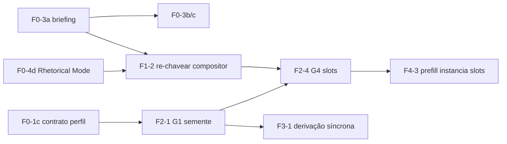

# Practice Profile — backlog de implementação (issues atômicas)

Decomposição atômica do **`docs/live/plan/practice-profile-plan.md`** (companheiro da **ADR 0010**). Uma issue = uma mudança independente e testável. Cada arquivo `FN-Nx-*.md` tem metadados → contexto → mudança (`file:line`) → aceite → verify → deps.

> **Status:** ✅ **6 fases (0→6) implementadas + gated** (2026-07-22, último commit `ed736e1`). 50 issues nas fases + **6 follow-ups pós-fase** (`FU-1..FU-6`, seção no fim) fechando as 4 ressalvas do fechamento. Cada issue nasce independente; as **deps** dizem a ordem, a **espinha** diz o que atacar primeiro.

## 🩸 Espinha do caminho crítico

**F0-3a** (briefing) → **F0-3b/c** → **F1-2** (re-chavear o compositor) → **F2-4** (slots) → **F4-3**. Em paralelo cedo: **F0-1c** (contrato do perfil) → **F2-1** (G1) → **F3-1** (onboarding).

---

## Fase 0 — Contratos & schema (17)

| Issue | Deps | CP |
|---|---|---|
| **F0-1c** · Contrato `PracticeProfile` (3 eixos + 7 dimensões) | — | |
| **F0-1a** · Migration `practice_profiles` | F0-1c | |
| **F0-1b** · Migration `practice_profile_diagnostics` | F0-1c | |
| **F0-1d** · Repositório `practice-profile` (upsert single-row) | F0-1a, F0-1c | |
| **F0-1e** · `GenerationContext` carrega o perfil como valor (governança) | F0-1c | |
| **F0-2a** · Contrato `WizardContextSchema` (eixos; remove `selfDeclaredStrength`) | — | |
| **F0-2b** · Web: gate da Tela 1 → `assunto && lugarDeFala && público≥1` | F0-2a | |
| **F0-3a** · Contrato: forma do briefing `{topic,audience,payload,anchor,resistance,stake}` | — | ⚠️ |
| **F0-3b** · Web: `buildBriefing()` produz a forma nova | F0-3a | ⚠️ |
| **F0-3c** · Backend: `getBriefingText()` serializa campos rotulados | F0-3a | ⚠️ |
| **F0-4a** · Ampliar `EpistemicPostureSchema` 3→7+`not_applicable` | — | |
| **F0-4b** · Prompt de extração p/ 7 valores | F0-4a | |
| **F0-4c** · Fallback `inferEpistemicPosture` p/ 7 valores | F0-4a | |
| **F0-4d** · Contrato `Rhetorical Mode` (dominante + secundário) | — | |
| **F0-5a** · Limpar `intent`+`contentType` de `ExecutionsListQuerySchema` | — | |
| **F0-5b** · Persistir `modo` no `data` da execução | F0-4d, F0-5a | |
| **F0-6** · `BackendGenerationPrefillRequest` muda de forma | F0-3a | |

## Fase 1 — A cirurgia 07+13 (6)

| Issue | Deps | CP |
|---|---|---|
| **F1-2** · Re-chavear `planGeneration` intent → gênero×tamanho×canal | F0-4d, F0-3a | ⚠️ |
| **F1-1a** · Remover o ramo legado de `resolve-generation-target` | F1-2 | |
| **F1-1b** · Remover `PipelineTypeSchema` + presets + catálogo | F1-2, F0-5a | |
| **F1-1c** · Remover os 7 pontos do `intent` | F1-2, F0-5a | |
| **F1-1d** · Deletar código morto da calibração | F3-4 | |
| **F1-3** · Re-chavear controles de modo (lentes + instruções) | F1-2, F0-4d | |

## Fase 2 — O gerador (8)

| Issue | Deps | CP |
|---|---|---|
| **F2-8** · Bloco compartilhado: leis + anti-padrões do gerador | — | |
| **F2-1** · G1 semente síncrona (especificidade paramétrica) | F0-1c, F0-1d, F2-8 | ⚠️ |
| **F2-2** · G2 enriquecimento assíncrono (grounding web) | F2-1 | |
| **F2-3** · G3 âncora de calibração | F2-1 | |
| **F2-4** · G4 slots de geração | F2-1, F0-3a, F1-3 | ⚠️ |
| **F2-5** · G5 pergunta HITL de nicho | F2-2 | |
| **F2-6** · Config cadeia Gemini→Groq (`catalog.json`) | F2-1 | |
| **F2-7** · Gate de discriminabilidade (T1-T4) | F2-4, F2-3 | |

## Fase 3 — Onboarding (5)

| Issue | Deps | CP |
|---|---|---|
| **F3-1** · Derivação síncrona do perfil-semente (tela 1→2) | F0-1c, F0-1d, F2-1 | ⚠️ |
| **F3-2** · Piso: bloquear+retentar, sem escape genérico | F3-1 | |
| **F3-3** · Locale na assinatura dos prompts | — | |
| **F3-4** · Trocar a ponta do seam pela âncora gerada | F2-3, F3-1 | |
| **F3-5** · Enriquecimento no rebuild de `completeReview` | F2-2, F0-1b | |

## Fase 4 — Geração (6)

| Issue | Deps | CP |
|---|---|---|
| **F4-2** · Estreitamento de público por chips (passo ①) | F0-1c | |
| **F4-1** · Popular `briefing.audience` | F0-3a, F4-2 | |
| **F4-3** · Prefill instancia os 4 slots | F2-4, F0-6 | ⚠️ |
| **F4-4** · Alavancas de acessibilidade de público | F4-1, F2-4 | |
| **F4-5** · Limpar resíduos tech-first do prompt | F4-4 | |
| **F4-6** · Vocabulário de chips de canal | — | |

## Fase 5 — `/voice` (4)

| Issue | Deps | CP |
|---|---|---|
| **F5-1** · `/voice` = identidade de escrita (voz + prática) | F0-1c, F0-1d | |
| **F5-2** · Edição in-place + aceitar/rejeitar enriquecimento | F5-1, F0-1b | |
| **F5-3** · Afordância da pergunta HITL de nicho | F5-1, F2-5 | |
| **F5-4** · Companion read-only + `settings` só espelha | F5-1 | |

## Fase 6 — Qualidade & eval (4)

| Issue | Deps | CP |
|---|---|---|
| **F6-1** · Confirmar régua neutra (NÃO construir régua por domínio) | F1-1c | |
| **F6-2** · Conjunto de avaliação multi-domínio (span de estilo) | F2-1 | |
| **F6-3** · Guardas de drift/critic → tabela declarativa | F0-4a | |
| **F6-4** · Re-chavear FEP content-type → canal | F1-1b | |

## Follow-ups pós-Fase 6 (pontas abertas do fechamento, 2026-07-22)

As 6 fases (0→6) estão **implementadas e passaram o portão de revisão**. Estes tickets fecham as 4 ressalvas do fechamento — não são fases novas, são pontas para "mapa completo" de verdade.

| Issue | Ressalva | Tipo | Bloqueia |
|---|---|---|---|
| **FU-1** · Push da branch + CI verde | 1 | processo | merge a `main` |
| **FU-2** · G2 grounding web nativo | 2 | plataforma (dep. `ai-adapters`) | — |
| **FU-3** · Seed órfão do `briefings.ts` (fiar ou deletar) | 3a | qualidade (F6-2) | — |
| **FU-4** · Dedup do mapa de canal (fonte única + round-trip) | 3b | seam-drift (F6-4) | — |
| **FU-5** · Dupla resolução de voz síncrona | 3c/4 | defeito → mapa de defeitos | — |
| **FU-6** · Rodar o mapa de defeitos de corretude até o fim | 4 | meta (mapa irmão) | "mapa completo" |

---

## Convenções
- **Governança a não quebrar** (toda issue de pacote Effect): `monorepo-governance`, `effect-hardening-governance`, `voice-profile-centralization`. Rodar `pnpm smoke` + `pnpm guardrails:effect`.
- **Coordenar com o mapa de defeitos** onde marcado (`briefing.question` morto; msg de `minWords` crua em inglês).
- **Fora do v1** (ADR 0010 → Out of scope): faceta de UI de `modo` no histórico; auto-propor deriva; múltiplos perfis.
- **Origem de cada issue:** ADR 0010 (o porquê), o norte em `.scratch/adaptacao-por-dominio/norte/` (os specs), o plano `docs/live/plan/practice-profile-plan.md` (a fase).
