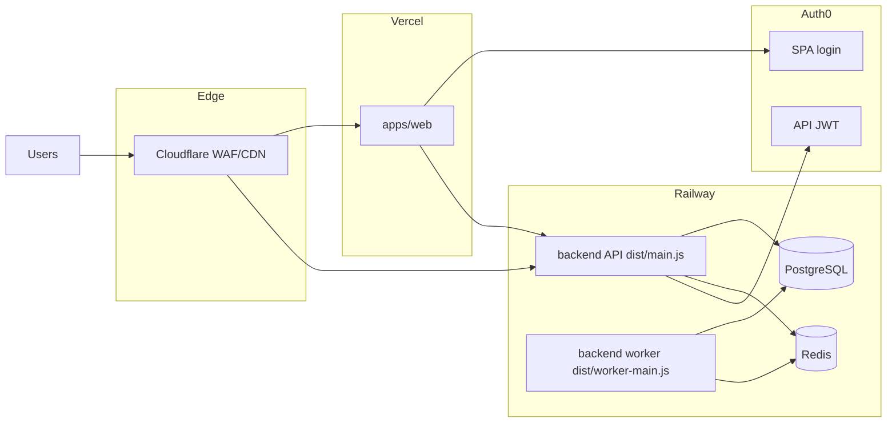

# Production Go-Live Runbook

Operational checklist for launching **Cultiv** (marketing on Vercel + authenticated workspace + backend API/worker). Use this after code is merged and before opening to real users.

**Related:** [Durable runtime HITL](./durable-async-runtime-hitl.md) · [ADR 0004](../../adr/0004-durable-async-runtime-zero-in-process-state.md) · [issue 08](../issues/08-seo-quality-and-vercel-deploy.md) · [issue 47](../issues/47-workspace-visual-qa-gate.md) · [issue 57](../issues/57-restart-multi-replica-verification-gate.md)

---

## Architecture snapshot



| Process | Command (production) | Required |
|---------|----------------------|----------|
| API | `pnpm --filter @my-ai-orchestrator/backend start` | Yes |
| Worker | `pnpm --filter @my-ai-orchestrator/backend worker` | Yes when `EXECUTION_MODE=async` |
| Migrate (release) | `pnpm --filter @my-ai-orchestrator/backend migrate` | Yes on every schema change |
| Build | `pnpm build:backend` | Yes before start/worker/migrate |

---

## Phase 0 — Pre-flight (local / staging)

Run once before touching production:

```bash
pnpm install
pnpm lint
pnpm build:backend
pnpm test
pnpm test:durable
pnpm hitl:durable-smoke   # requires Docker PG+Redis + GEMINI_API_KEY
```

**Pass criteria**

- [ ] All commands exit 0
- [ ] `hitl:durable-smoke` completes with terminal job status `done` or `failed` (not lost)

**Sign-off:** _________________ Date: _______

---

## Phase 1 — Secrets and environment

### Backend (Railway or equivalent)

| Variable | Production value | Notes |
|----------|------------------|-------|
| `NODE_ENV` | `production` | Enables strict validation |
| `EXECUTION_MODE` | `async` | **Required** — product uses job-backed runs |
| `DATABASE_URL` | Railway Postgres plugin | Required |
| `REDIS_URL` | Railway Redis plugin | Required; use `noeviction` or documented policy |
| `AUTH_ISSUER_URL` | `https://<tenant>.auth0.com/` | Must match Auth0 tenant |
| `AUTH_AUDIENCE` | `https://api.cultiv.app` | Same as Auth0 API identifier |
| `AUTH_JWKS_URL` | `https://<tenant>.auth0.com/.well-known/jwks.json` | |
| `CORS_ALLOWED_ORIGINS` | `https://www.cultiv.app` (comma-separated) | **Required** — no default in prod |
| `VOICE_DATA_PROTECTION_KEY` | ≥32 random chars | **Required** — encrypts voice examples at rest |
| `GEMINI_API_KEY` (or other provider) | secret | At least one generation provider |
| `SERVICE_NAME` | `backend` | |
| `APP_VERSION` | release tag / semver | |
| `BACKEND_TRUST_PROXY` | `true` (default when unset in prod) | Trust `X-Forwarded-For` behind Railway/CF |
| `BACKEND_ALLOW_IN_MEMORY_RUNTIME` | **unset or `false`** | **Forbidden** in production (boot fails if `true`) |

Optional tuning:

| Variable | Suggested |
|----------|-----------|
| `RATE_LIMIT_MAX_REQUESTS` | `60` |
| `RATE_LIMIT_WINDOW_MS` | `60000` |
| `EXECUTION_WORKER_CONCURRENCY` | `2`–`4` |

### Web (Vercel)

| Variable | Notes |
|----------|-------|
| `SITE_URL` | Canonical URL, e.g. `https://www.cultiv.app` |
| `VITE_API_BASE_URL` | `https://api.cultiv.app` |
| `VITE_AUTH0_DOMAIN` | Host only, no `https://` |
| `VITE_AUTH0_CLIENT_ID` | Auth0 SPA client |
| `VITE_AUTH0_AUDIENCE` | Same as `AUTH_AUDIENCE` |
| `REDIS_URL` | **Required** for waitlist rate limit (can share backend Redis) |
| `LOOPS_API_KEY` | Server-only (waitlist) |
| `LOOPS_WAITLIST_ID` | Server-only |

See `apps/web/.env.example` and `.env.example` at repo root.

**Pass criteria**

- [ ] No secrets committed to git
- [ ] Production backend boot succeeds with env above (dry-run on staging first)
- [ ] `BACKEND_ALLOW_IN_MEMORY_RUNTIME` is not set to `true`

**Sign-off:** _________________ Date: _______

---

## Phase 2 — Railway deploy

### 1. Create project and plugins

1. New Railway project → **Deploy from GitHub** → this monorepo, branch `main`, root directory `/`
2. Add **PostgreSQL** plugin → note injected `DATABASE_URL`
3. Add **Redis** plugin → note injected `REDIS_URL` (enable persistence / AOF on managed plan)
4. Create two **empty services** from the same repo (or duplicate the first after stripping plugins):
   - `api`
   - `worker`

Do **not** attach Postgres/Redis plugins to `api`/`worker` directly — reference the plugin variables in each service env (Railway shared variables or `${{Postgres.DATABASE_URL}}` syntax).

### 2. Config-as-code

| Service | Config file | Auto-detected? |
|---------|-------------|----------------|
| `api` | `/railway.toml` | Yes (repo root) |
| `worker` | `/railway.worker.toml` | **No** — set **Settings → Config File Path** to `/railway.worker.toml` |

Both files live at the monorepo root. Build: `pnpm install --frozen-lockfile && pnpm build:backend`.

| Service | Start | Pre-deploy | Health |
|---------|-------|------------|--------|
| `api` | `pnpm --filter @my-ai-orchestrator/backend start` | `pnpm --filter @my-ai-orchestrator/backend migrate` | `GET /health` |
| `worker` | `pnpm --filter @my-ai-orchestrator/backend worker` | — | none (no HTTP) |

Railway injects `PORT` for `api`; backend binds `HOST=0.0.0.0` + `PORT`.

### 3. Environment variables (api + worker)

Copy Phase 1 backend table to **both** services. Minimum:

- `NODE_ENV=production`
- `EXECUTION_MODE=async`
- `DATABASE_URL`, `REDIS_URL` (from plugins)
- `AUTH_ISSUER_URL`, `AUTH_AUDIENCE`, `AUTH_JWKS_URL`
- `CORS_ALLOWED_ORIGINS` (e.g. `https://www.cultiv.app`)
- `VOICE_DATA_PROTECTION_KEY` (≥32 chars)
- `GEMINI_API_KEY` (or another provider)
- `SERVICE_NAME=backend`, `APP_VERSION=<release>`
- `BACKEND_TRUST_PROXY=true` (default in prod)

Forbidden: `BACKEND_ALLOW_IN_MEMORY_RUNTIME=true`

Optional: `EXECUTION_WORKER_CONCURRENCY`, `RATE_LIMIT_*`

### 4. Custom domain

- `api` service → Settings → Networking → `api.cultiv.app` (or staging subdomain)
- Point Cloudflare CNAME to Railway (Phase 3)

### Deploy order

1. Deploy **api** (runs `migrate` via `preDeployCommand` in `railway.toml`)
2. Deploy **worker**
3. Re-deploy **api** if worker was first by mistake

**Pass criteria**

- [ ] `curl -s https://api.cultiv.app/health` → `200`
- [ ] `curl -s https://api.cultiv.app/ready` → `200` (all checks ready)
- [ ] Worker logs: `Backend execution worker started`
- [ ] API logs: durable runtime / outbox relay (no in-memory warning)

**Sign-off:** _________________ Date: _______

---

## Phase 3 — Cloudflare (edge)

Document your WAF product and rules (see [durable HITL §2](./durable-async-runtime-hitl.md)).

**Baseline**

- [ ] Orange-cloud `api.cultiv.app` → Railway origin
- [ ] TLS full (strict)
- [ ] Rate limit: `POST /me/executions/*` (e.g. 30 req/min per IP)
- [ ] SSE: note CF ~100s idle limit; backend sends heartbeat every 25s (`job-events.ts`)

**Sign-off:** _________________ Date: _______

---

## Phase 4 — Vercel (marketing + workspace)

1. Import GitHub repo → **Root Directory:** `apps/web` (not monorepo root)
2. Framework: TanStack Start (detected via `apps/web/vercel.json`)
3. Install command (already in `vercel.json`): `cd ../.. && pnpm install --frozen-lockfile`
4. Build command: `pnpm build` (runs inside `apps/web`)
5. `apps/web/vercel.json` install: `cd ../.. && npx -y pnpm@11.3.0 install --frozen-lockfile` (pnpm 11 + monorepo root); Root Directory **must** be `apps/web`
6. Production env vars (Phase 1 web table)
7. Custom domain DNS (`cultiv.app` / `www`)

**Smoke tests**

- [ ] `/` and `/en` load; locale toggle works
- [ ] Legal pages render
- [ ] Waitlist signup reaches Loops (production list)
- [ ] Lighthouse mobile: performance ≥ 90, accessibility ≥ 90 on `/` (issue 08)

**Sign-off:** _________________ Date: _______

---

## Phase 5 — Auth0 production tenant

- [ ] SPA callback URLs include `https://www.cultiv.app` (and preview URLs if needed)
- [ ] Logout URLs configured
- [ ] API audience `https://api.cultiv.app` authorized for SPA
- [ ] Test login → `/app/generate` loads with token

**Sign-off:** _________________ Date: _______

---

## Phase 6 — End-to-end product smoke

Run as a real user (not test JWT):

1. Sign up / log in via Auth0
2. Complete onboarding if shown
3. Add voice example (if empty profile)
4. Submit generation on `/app/generate`
5. Confirm `202` response; drawer shows progress; toast on completion
6. Verify history entry in `/app/history`
7. Restart API process (rolling deploy) mid-generation → drawer/SSE recovers ([HITL §5](./durable-async-runtime-hitl.md))

**Pass criteria**

- [ ] Generation completes (`done` or clear `failed` with message)
- [ ] Billing/credits consistent (no double capture)
- [ ] No CORS errors in browser console

**Sign-off:** _________________ Date: _______

---

## Phase 7 — Data protection and backups

| Asset | Action |
|-------|--------|
| PostgreSQL | Enable Railway backups or schedule `pg_dump` to object storage |
| Redis | Document eviction policy (`noeviction` preferred); queue depth monitoring |
| Voice key | Store `VOICE_DATA_PROTECTION_KEY` in secrets manager (generate: `openssl rand -base64 32`) |

### Voice key rotation (`VOICE_DATA_PROTECTION_KEY`)

Rotation is **not** automatic on env change. Use dual-key read + explicit re-encrypt command.

**Tables affected:** `voice_examples`, `voice_example_batches` (fields `text`, `context`, batch `stagedInput`).

**Procedure**

1. Generate new key: `openssl rand -base64 32`
2. In Railway secrets (api + worker):
   - Set `VOICE_DATA_PROTECTION_KEY` = **new** key
   - Set `VOICE_DATA_PROTECTION_KEY_PREVIOUS` = **old** key
3. Deploy api + worker (runtime reads decrypt with current, then fallback to previous)
4. Dry-run rotation:
   ```bash
   pnpm build:backend
   pnpm --filter @my-ai-orchestrator/backend rotate-voice-key:dry-run
   # Include legacy plaintext rows (pre-voiceprot:v1):
   pnpm --filter @my-ai-orchestrator/backend rotate-voice-key:dry-run -- --encrypt-plaintext
   ```
5. Execute rotation (release/maintenance window; API can stay up — writes use new key):
   ```bash
   pnpm --filter @my-ai-orchestrator/backend rotate-voice-key
   # Or with plaintext backfill:
   pnpm --filter @my-ai-orchestrator/backend rotate-voice-key -- --encrypt-plaintext
   ```
6. Verify voice reads in `/app/voice` for a user with examples
7. Remove `VOICE_DATA_PROTECTION_KEY_PREVIOUS` from secrets; redeploy api + worker

**Rollback:** if rotation fails mid-run, keep `PREVIOUS` set and re-run after fix. Restore DB from backup only if ciphertext is corrupted.

Implementation: `apps/backend/src/safety/voice-field-protection-rotation.ts`, CLI `rotate-voice-protection-key.ts`.

**Pass criteria**

- [ ] Restore procedure documented (even if manual)
- [ ] Team knows who can access production DB
- [ ] Voice key rotation procedure rehearsed on staging (or dry-run in prod)

**Sign-off:** _________________ Date: _______

---

## Phase 8 — QA gates (HITL)

| Gate | Doc | Status |
|------|-----|--------|
| Workspace visual QA | [issue 47](../issues/47-workspace-visual-qa-gate.md) | [ ] |
| Durable runtime HITL | [durable-async-runtime-hitl.md](./durable-async-runtime-hitl.md) §1–§5 | [ ] |
| Marketing SEO deploy | [issue 08](../issues/08-seo-quality-and-vercel-deploy.md) | [ ] |

---

## Phase 9 — Post-launch monitoring (first 48h)

- [ ] Watch API `/ready` and Railway health
- [ ] Watch worker error logs (`Worker execution failed`)
- [ ] Watch Redis memory and PG connections
- [ ] Watch Auth0 anomaly / rate limit 429s on API

No APM in-repo yet — logs are `console` with redaction. Plan structured logging post-MVP.

---

## Rollback

1. Revert Railway deploy to previous image / commit
2. **Do not** run down migrations automatically — forward-fix preferred
3. If schema migration already ran, deploy code compatible with new schema or restore DB from backup

---

## Quick reference — forbidden in production

The backend **refuses to boot** in `NODE_ENV=production` when:

- `BACKEND_ALLOW_IN_MEMORY_RUNTIME=true`
- `EXECUTION_MODE` is not `async`
- `CORS_ALLOWED_ORIGINS` is missing or empty
- `VOICE_DATA_PROTECTION_KEY` is missing or shorter than 32 characters
- `DATABASE_URL` or `REDIS_URL` is missing
- Auth0 fields are missing

Implementation: `apps/backend/src/config/config.ts` → `validateBackendConfig`.

---

## Changelog

| Date | Change |
|------|--------|
| 2026-06-14 | Initial runbook; production config hardening in `config.ts` |
