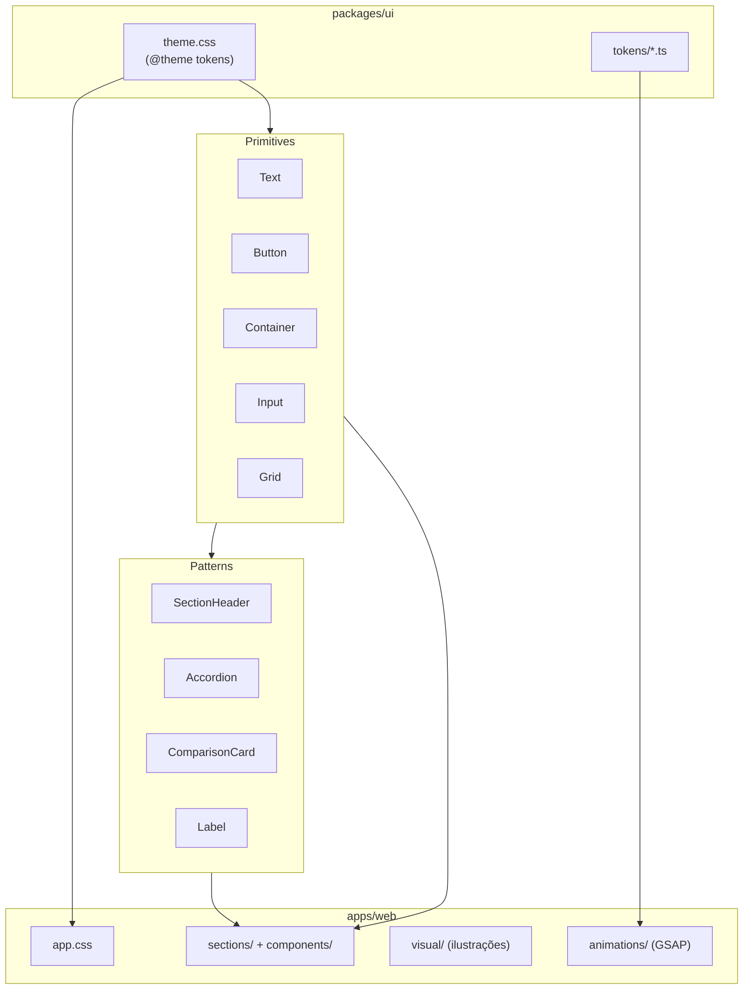

# Design System — estrutura e referência

O design system do monorepo vive no pacote **`packages/ui`** (`@my-ai-orchestrator/ui`) e é consumido principalmente pela superfície de marketing em **`apps/web`**. A organização segue uma separação em camadas: tokens → primitives → patterns.

Documentação relacionada:

- [Direção criativa](./design-system-creative-direction.md) — brief editorial premium
- [Sistema de animação](./system-animation.md) — GSAP, Lenis, scroll reveal
- [Issue: Design System and Web Scaffold](../issues/01-design-system-and-web-scaffold.md) — critérios de aceite da fundação

---

## Visão geral do pacote

```
packages/ui/
├── src/
│   ├── styles/theme.css      # tokens CSS + utilitários visuais (Tailwind v4 @theme)
│   ├── tokens/               # tokens TypeScript (motion, spacing)
│   ├── primitives/           # componentes base reutilizáveis
│   ├── patterns/             # composições de marketing
│   ├── lib/cn.ts             # merge de classes Tailwind (tailwind-merge)
│   └── index.ts              # ponto único de exportação
├── package.json
└── tsconfig.json
```

### Exports do pacote

| Export | Caminho | Uso |
|--------|---------|-----|
| Componentes e tokens JS | `@my-ai-orchestrator/ui` | `import { Button, Text, motionTokens } from "…"` |
| Tema CSS | `@my-ai-orchestrator/ui/styles/theme.css` | `@import` no CSS do app |

---

## 1. Tokens (fundação visual)

### CSS — `src/styles/theme.css`

Fonte principal dos tokens via **Tailwind CSS v4** (`@theme`). Define variáveis consumidas como utilitários Tailwind (`bg-surface`, `text-foreground`, `font-display`, etc.).

#### Tipografia

| Token | Fonte |
|-------|-------|
| `--font-display` | Playfair Display, Georgia, serif |
| `--font-handwritten` | Caveat, cursive |
| `--font-body` | Inter, system-ui, sans-serif |
| `--font-mono` | JetBrains Mono, ui-monospace, monospace |

#### Cores semânticas

| Token | Valor (light) | Papel |
|-------|---------------|-------|
| `--color-surface` | `#f5f0e8` | Fundo “papel quente” |
| `--color-surface-elevated` | `#faf7f2` | Superfície elevada |
| `--color-foreground` | `#1e2f2a` | Texto principal (“rich soil”) |
| `--color-muted` | `#5c6b66` | Texto secundário |
| `--color-ghost` | `#ddd4c8` | Texto decorativo / baixo contraste |
| `--color-moss` / `--color-accent` | `#6b9080` | Acento primário |
| `--color-golden` / `--color-accent-secondary` | `#d4a843` | Acento secundário |
| `--color-border` | `#1e2f2a` | Bordas editoriais |
| `--color-border-subtle` | `#d9cfc2` | Bordas suaves |
| `--color-showcase` | `#243830` | Fundo de seções showcase |
| `--color-showcase-foreground` | `#f5f0e8` | Texto em showcase |
| `--color-invert` | `#1e2f2a` | Blocos invertidos |

#### Espaçamento e forma

| Token | Valor | Papel |
|-------|-------|-------|
| `--spacing-section` | `5.5rem` | Padding vertical de seção |
| `--spacing-section-sm` | `3.5rem` | Seção compacta |
| `--spacing-gutter` | `clamp(1.25rem, 4vw, 2.5rem)` | Gutter responsivo |
| `--radius-sm` / `--radius-md` | `0` | Sem cantos arredondados (estética editorial) |
| `--tracking-editorial` | `0.18em` | Labels e meta |
| `--tracking-editorial-wide` | `0.28em` | Labels amplos |
| `--site-header-height` | `4.25rem` / `5.25rem` (md+) | Altura do header fixo |

#### Dark theme

Variáveis sob a classe `.dark` estão **preparadas** mas **não consumidas na UI de produto** — apenas o tema claro está ativo.

#### Utilitários CSS customizados

Além dos tokens `@theme`, o arquivo define classes reutilizáveis:

| Classe | Papel |
|--------|-------|
| `.font-display`, `.font-handwritten`, `.font-mono-data` | Famílias tipográficas |
| `.editorial-rule`, `.editorial-frame` | Bordas editoriais |
| `.text-ghost`, `.text-golden`, `.text-moss` | Cores de destaque |
| `.organic-glow`, `.organic-glow-hero`, `.organic-glow-invert` | Gradientes botânicos |
| `.paper-grain` | Textura de papel (SVG noise) |
| `.tech-chip` | Chip mono uppercase |
| `.motion-hover` | Hover discreto (`translateY(-2px)`) |
| `.h-hero-viewport` | Altura do hero descontando o header |
| `.waitlist-form-panel` | Layout do painel de waitlist |
| `.hero-tree-layer` | Máscara radial para ilustração do hero |

Estilos globais em `@layer base`: `body` com `bg-surface`, `font-body`, `text-foreground`; `::selection` com mix moss/golden.

### TypeScript — `src/tokens/`

#### `spacing.ts`

```typescript
export const spacingTokens = {
  sectionY: "4rem",
  containerMax: "72rem",
  gutter: "1.5rem"
} as const;
```

#### `motion.ts`

```typescript
export const motionTokens = {
  reveal: { duration: 0.8, y: 40, ease: "power2.out" },
  hover: { duration: 0.2, y: -2, ease: "power2.out" },
  stagger: 0.15
} as const;
```

> **Nota:** os mesmos valores de motion existem duplicados em `apps/web/src/animations/gsap-config.ts` como `MOTION`. A animação em si (GSAP/Lenis) vive no app web, não no pacote UI.

---

## 2. Primitives (componentes base)

Local: `packages/ui/src/primitives/`

| Componente | Arquivo | Descrição |
|------------|---------|-----------|
| **Text** | `Text.tsx` | Sistema tipográfico com variantes |
| **Button** | `Button.tsx` | Botão editorial |
| **Container** | `Container.tsx` | Wrapper com max-width e gutter |
| **Input** | `Input.tsx` | Campo de texto |
| **Grid** | `Grid.tsx` | Grid responsivo 1/2/3 colunas |

### Text — variantes

| Variante | Uso |
|----------|-----|
| `chapter` | Títulos de seção grandes (clamp até ~8.5rem) |
| `display` | Display principal |
| `display-sm` | Display compacto |
| `h1`, `h2`, `h3` | Hierarquia de headings |
| `body-lg`, `body` | Corpo de texto |
| `handwritten` | Acentos manuscritos (Caveat) |
| `caption`, `label` | Labels uppercase com tracking editorial |
| `meta`, `mono` | Dados técnicos (JetBrains Mono, moss) |

Títulos usam `font-handwritten` (Caveat) com `clamp()` para escala fluida — mesma família das notas editoriais e do wordmark Cultiv na página.

### Button — variantes

| Variante | Estilo |
|----------|--------|
| `primary` | Fundo foreground, texto surface (papel); hover inverte |
| `ghost` | Transparente; hover ganha borda |
| `invert` | Para fundos escuros |

Tamanhos: `default` (padding generoso, `w-fit`) · `compact` (header/mobile). Layout via `.ui-btn` em `theme.css` — não depende de utilitários Tailwind escaneados.

### Container

- `max-w-[88rem]` + `px-[var(--spacing-gutter)]`
- Suporta `ref` via `forwardRef`

### Grid

- `columns`: `1` | `2` | `3`
- Responsivo: 1 coluna no mobile, N colunas a partir de `md`

---

## 3. Patterns (composições de marketing)

Local: `packages/ui/src/patterns/`

Componentes de nível superior, compostos com primitives:

| Pattern | Arquivo | Uso |
|---------|---------|-----|
| **SectionHeader** | `SectionHeader.tsx` | Eyebrow + título `chapter` + descrição; props `invert`, `highlight` |
| **Accordion** | `Accordion.tsx` | FAQ editorial com índice `[01]`, `[02]`… |
| **ComparisonCard** | `ComparisonCard.tsx` | Comparação genérico vs. com voz (showcase) |
| **Label** | `Label.tsx` | Rótulo indexado `[n]` |

---

## 4. Utilitário `cn()`

`packages/ui/src/lib/cn.ts` — wrapper sobre `tailwind-merge` para composição segura de classes Tailwind.

```typescript
import { twMerge } from "tailwind-merge";

export function cn(...inputs: ReadonlyArray<string | false | undefined>): string {
  return twMerge(inputs.filter(Boolean).join(" "));
}
```

---

## 5. Integração com `apps/web`

### Dependência

```json
"@my-ai-orchestrator/ui": "workspace:*"
```

### CSS do app

`apps/web/src/styles/app.css`:

```css
@import "tailwindcss" source("../");
@import "@my-ai-orchestrator/ui/styles/theme.css";
```

- **Tailwind v4** via `@tailwindcss/vite`
- Estilos adicionais do app ficam em `app.css` (ex.: `.showcase-output-scroll`) — não no pacote compartilhado
- Sem CSS inline; estilização via Tailwind + tema compartilhado

### O que fica fora do `packages/ui`

Camadas específicas do marketing em `apps/web`:

```
apps/web/src/
├── animations/     # GSAP + Lenis (hooks: use-stagger, use-scroll-reveal, …)
├── visual/         # Ilustrações botânicas, LetterReveal, StampBadge
├── sections/       # HeroSection, FaqSection, ShowcaseSection
└── components/     # SiteHeader, WaitlistForm, ShowcaseSlide, …
```

---

## 6. Princípios de design

| Princípio | Implementação |
|-----------|---------------|
| **Editorial / premium** | Hierarquia tipográfica forte, neutros quentes, bordas retas |
| **Conteúdo em destaque** | Interface recua; cor comunica estado, não decora |
| **Motion discreto** | Reveal, fade, stagger; `prefers-reduced-motion` nos hooks GSAP |
| **Reuso fase 2** | Pacote compartilhado para marketing hoje e app autenticado depois |
| **Sem inline CSS** | Tokens + Tailwind + componentes |

### Linguagem visual (marketing)

- Tema claro editorial com ilustrações botânicas
- Paleta: papel quente, rich soil, moss, golden
- Tipografia: Playfair Display (display), Caveat (handwritten), Inter (body), JetBrains Mono (meta)

---

## 7. Diagrama de arquitetura



---

## 8. O que ainda não existe

- Storybook ou catálogo visual interativo
- Preset Tailwind separado (o “preset” é o `theme.css` importado diretamente)
- Dark theme productizado
- Pacote mobile / NativeWind (há design arquivado em `docs/archive/ui/` para stack antiga Geist + shadcn)

---

## 9. Referência rápida de imports

```typescript
// Componentes e tokens
import {
  Text,
  Button,
  Container,
  Input,
  Grid,
  SectionHeader,
  Accordion,
  ComparisonCard,
  Label,
  cn,
  motionTokens,
  spacingTokens
} from "@my-ai-orchestrator/ui";
```

```css
/* No CSS do app */
@import "@my-ai-orchestrator/ui/styles/theme.css";
```
